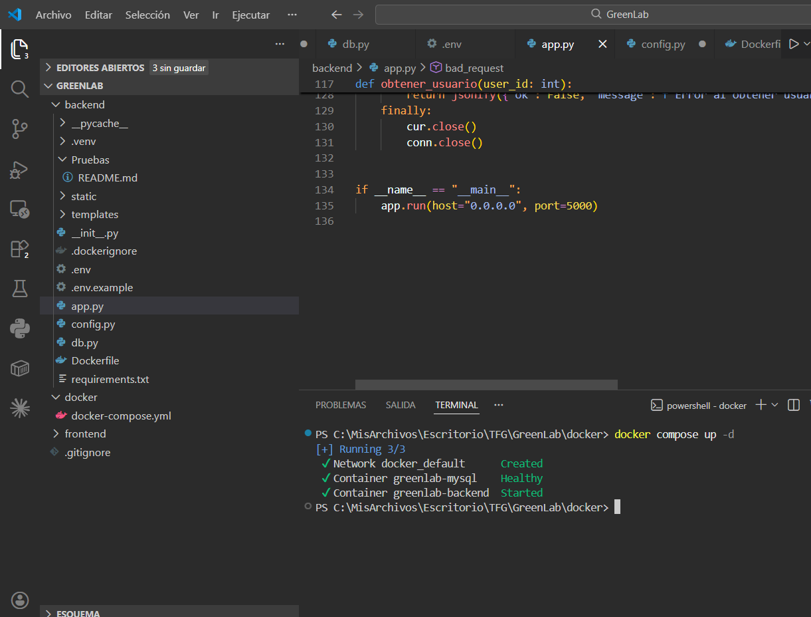
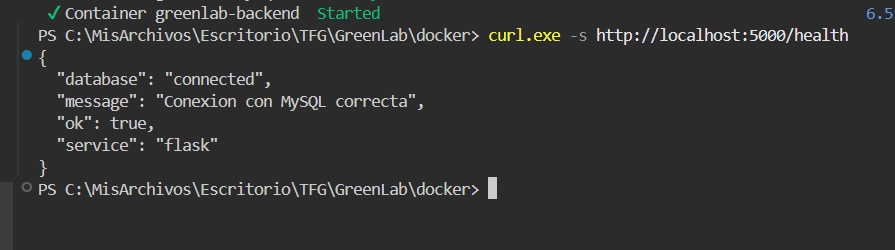
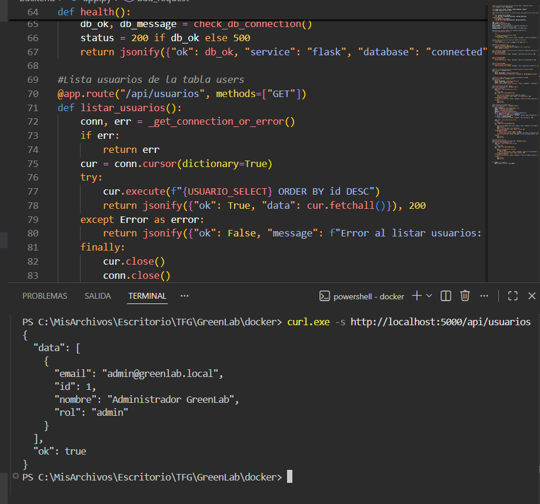
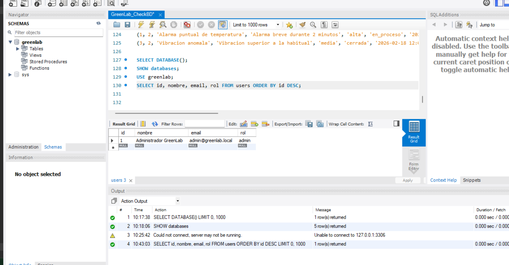
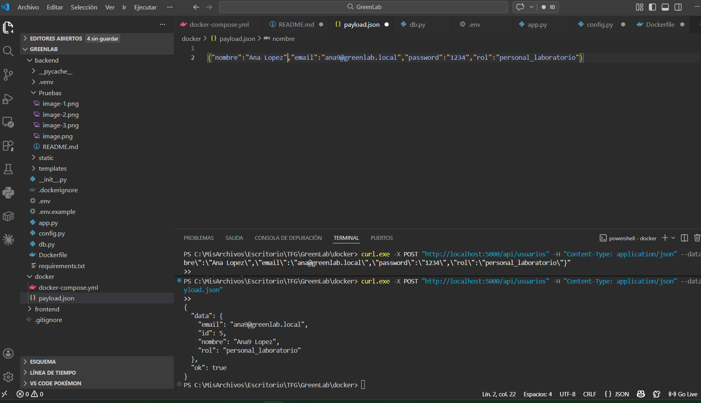

Prueba de conexión

    -Levantamos la conexión:
    

    -Curl para comprobar el estado de conexión (ok = está bien):
    

    -Prueba obtención (GET) de datos desde la base de datos:
    
    

    -Prueba (POST): Requerimiento previo es configurar los datos que se pretenden insertar dentro del archivo payload.json para las pruebas --> curl.exe -X POST "http://localhost:5000/api/usuarios" -H "Content-Type: application/json" --data-binary "@payload.json":
    
