Prueba de conexión

    -Levantamos la conexión:
    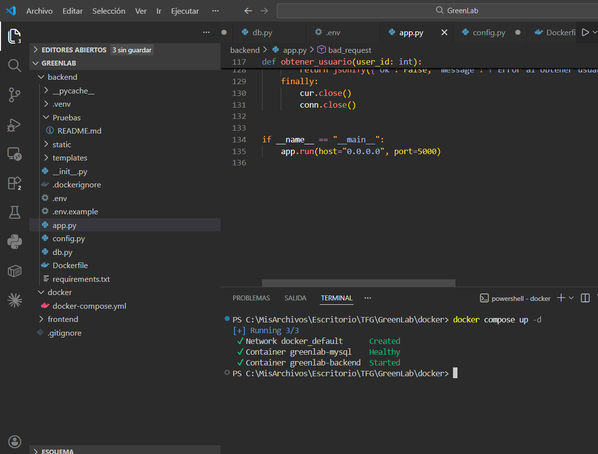

    -Curl para comprobar el estado de conexión (ok = está bien):
    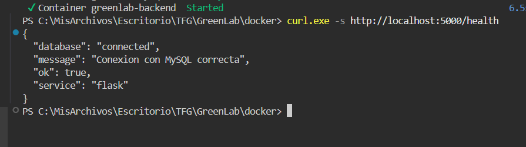

    -Prueba obtención (GET) de datos desde la base de datos:
    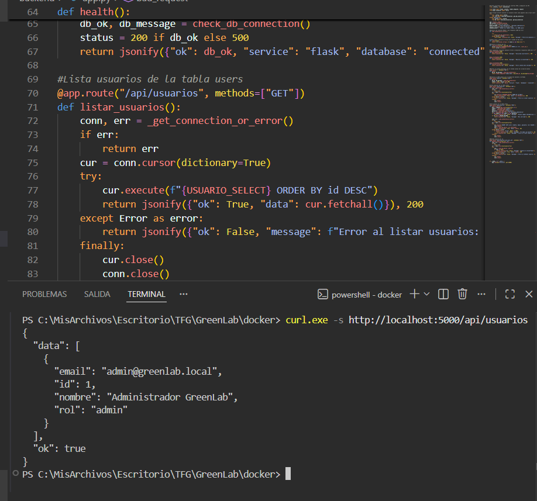
    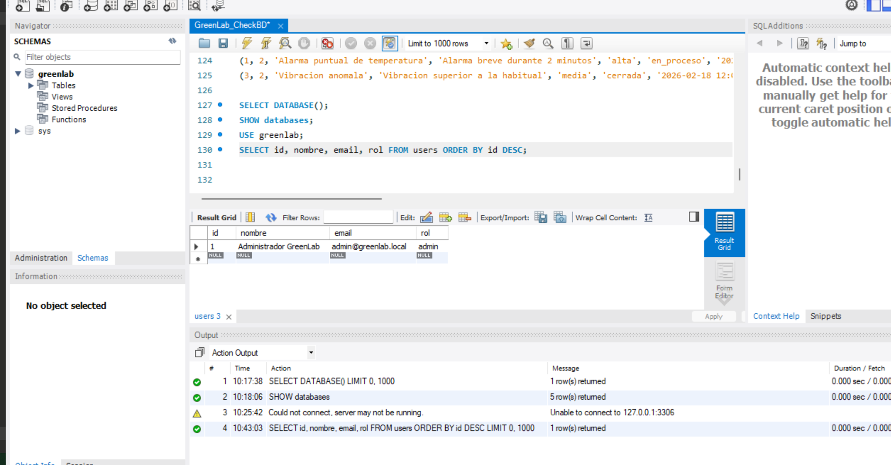

    -Prueba (POST): Requerimiento previo es configurar los datos que se pretenden insertar dentro del archivo payload.json para las pruebas --> curl.exe -X POST "http://localhost:5000/api/usuarios" -H "Content-Type: application/json" --data-binary "@payload.json":
    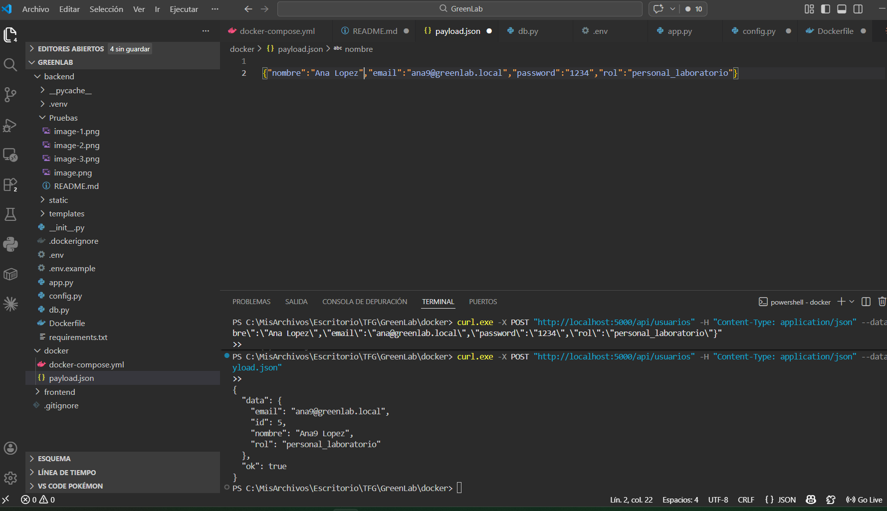
    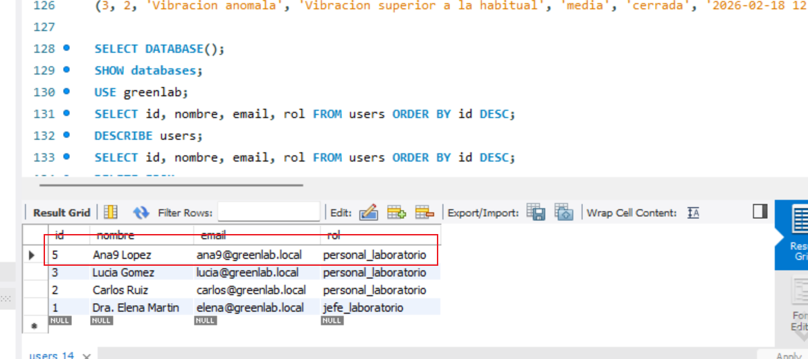

    -Prueba (PUT):
    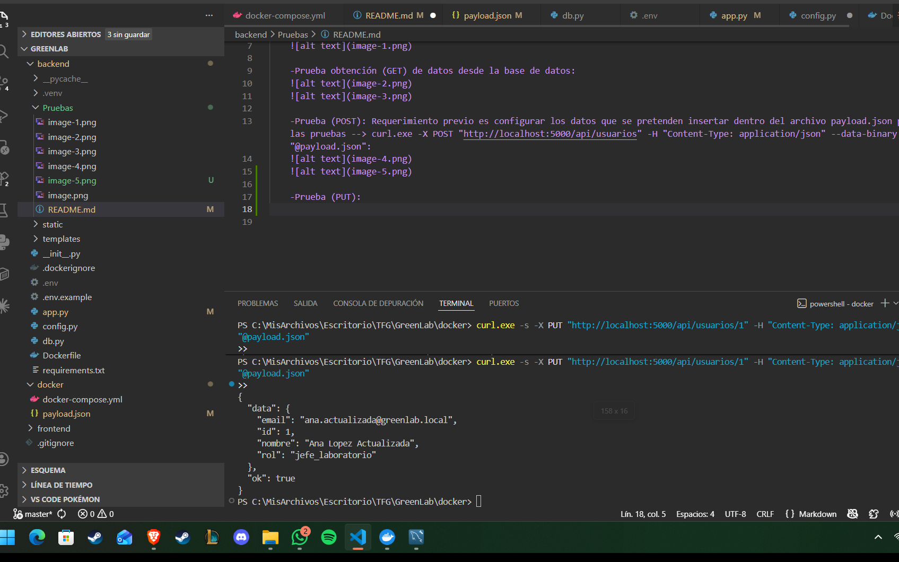
    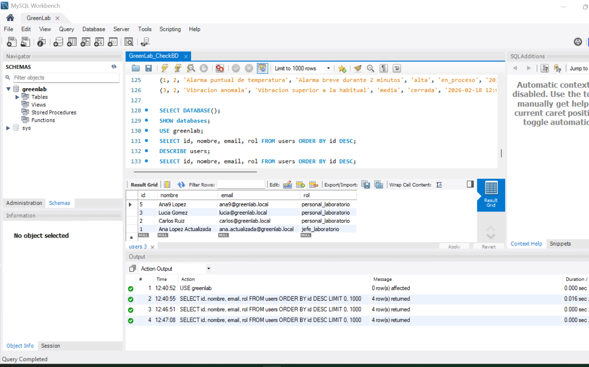

    -Prueba (DELETE);
    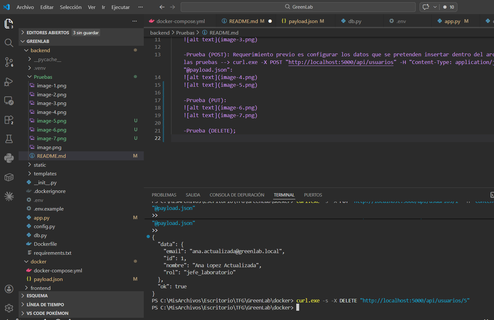
    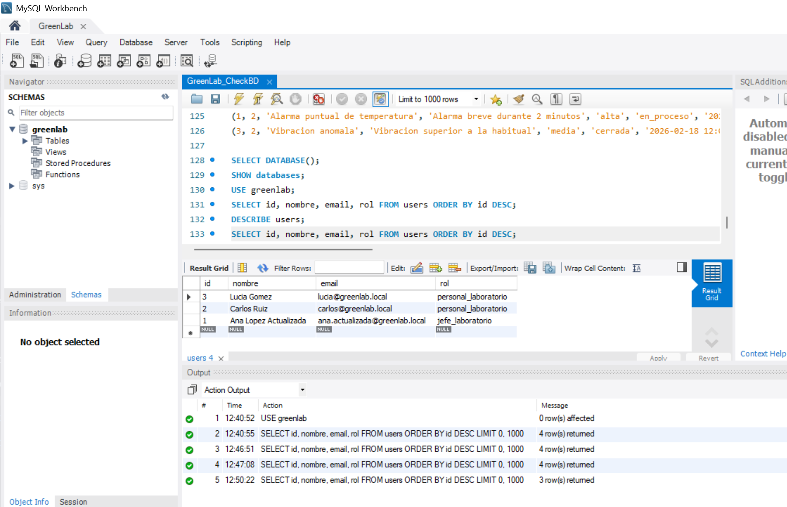

    -Prueba (POST) de login --> se pide emial y password
    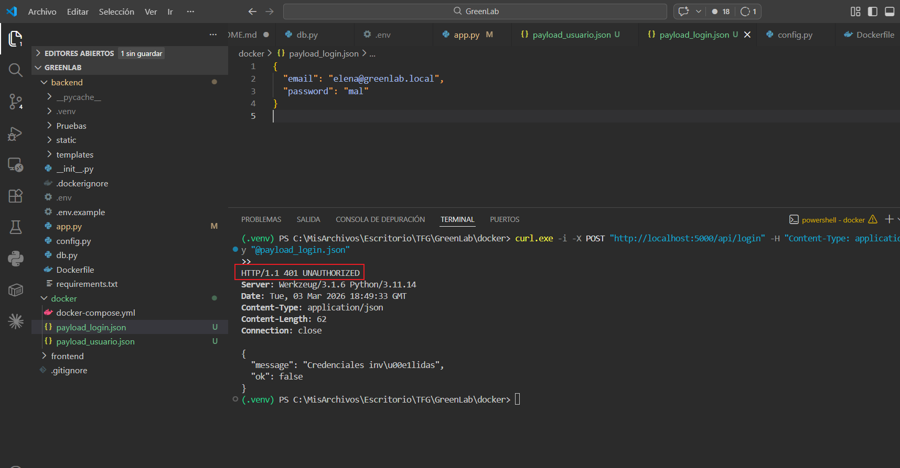

    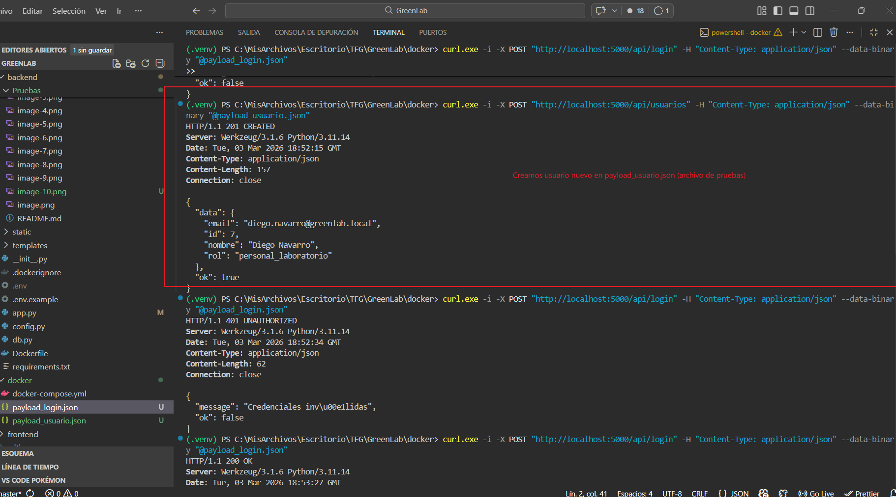
    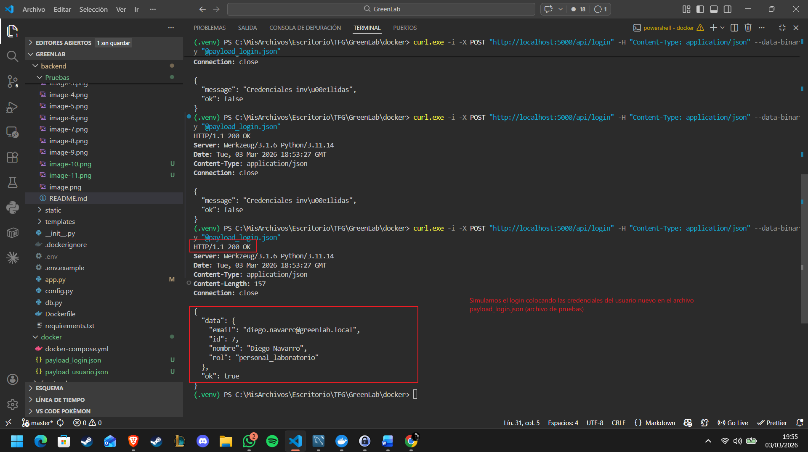

    -Prueba arranque aplicación con Flask:
    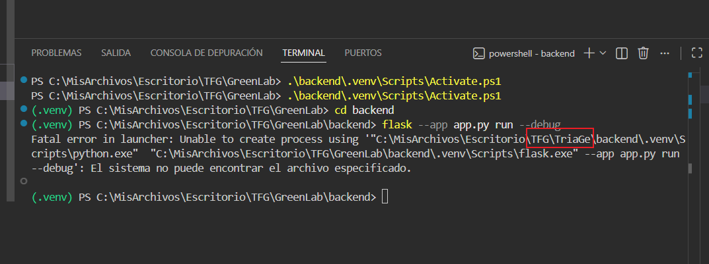

    Comando utilizado:
    python -m flask --app app.py run --debug
    Da error porque apunta a la anterior versión de la app que se llamaba TriaGe.

    Este comando sirve para iniciar el servidor de desarrollo de Flask cargando la aplicación definida en `app.py` lo que permite recarga automática al guardar cambios y muestra detallada de errores durante el desarrollo.
